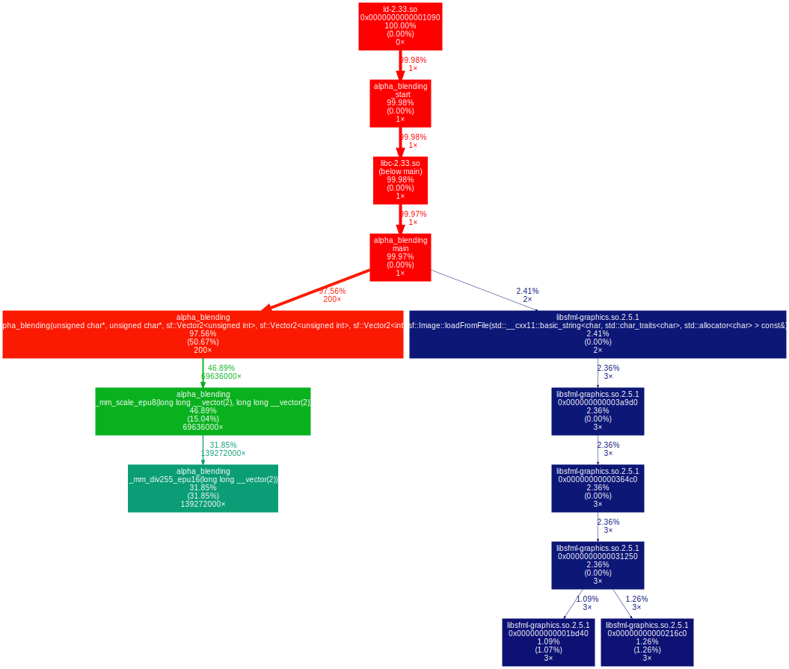
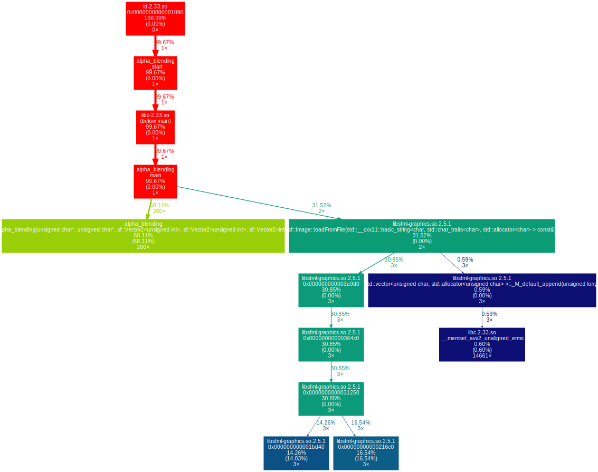

# Alpha blending

## Table of contents

[Main page](https://github.com/Panterrich/Alpha_blending)

[№0 optimization - the starting tests](https://github.com/Panterrich/Alpha_blending/tree/ver_0)

[№1 optimization - reduce overhead costs](https://github.com/Panterrich/Alpha_blending/tree/ver_1)

[№2 optimization - getting rid of divisions](https://github.com/Panterrich/Alpha_blending/tree/ver_2)

[№3 optimization - SSE optinization](https://github.com/Panterrich/Alpha_blending/tree/ver_3)
## №3 optimization.

Okay, it's time to use heavy artillery - SSE optimization.
To speed up the program, we will process 4 RGBA pixels at once, so the image area (the area of the front image that does not get out outside the back image) that we are processing must be aligned in width.

As a result, we get the following implementation.

```C++
static const __m128i max = _mm_set1_epi8(255);  

static inline __m128i _mm_div255_epu16(__m128i x)
{
	// x = ((x + 1) + (x >> 8)) >> 8:
	return _mm_srli_epi16(_mm_adds_epu16(
		                  _mm_adds_epu16(x, _mm_set1_epi16(1)),
		                  _mm_srli_epi16(x, 8)), 8);
}

static __m128i _mm_scale_epu8 (__m128i x, __m128i y)
{
	// x = x * (y / 255)
	// Reorder: x = (x * y) / 255

	// Unpack x and y into 16-bit uints:
	__m128i xlo = _mm_unpacklo_epi8(x, _mm_setzero_si128());
	__m128i ylo = _mm_unpacklo_epi8(y, _mm_setzero_si128());
	__m128i xhi = _mm_unpackhi_epi8(x, _mm_setzero_si128());
	__m128i yhi = _mm_unpackhi_epi8(y, _mm_setzero_si128());

	// Multiply x with y, keeping the low 16 bits:
	xlo = _mm_mullo_epi16(xlo, ylo);
	xhi = _mm_mullo_epi16(xhi, yhi);

	// Divide by 255:
	xlo = _mm_div255_epu16(xlo);
	xhi = _mm_div255_epu16(xhi);

	// Repack the 16-bit uints to clamped 8-bit values:
	return _mm_packus_epi16(xlo, xhi);
}

void Alpha_blending(sf::Uint8* back, sf::Uint8* front, \
                    const sf::Vector2u size_back, const sf::Vector2u size_front, const sf::Vector2i shift)
{
    size_t begin_back_y  = (shift.y > 0) ? shift.y : 0;
    size_t begin_front_y = (shift.y > 0) ? 0 : -shift.y;
    size_t begin_back_x  = (shift.x > 0) ? shift.x : 0;
    size_t begin_front_x = (shift.x > 0) ? 0 : -shift.x;
    
    for (size_t back_y = begin_back_y, front_y = begin_front_y; \
                (back_y < size_back.y && front_y < size_front.y); ++back_y, ++front_y)
    {
        sf::Uint8* current_back  = back  + ((back_y  * size_back.x  + begin_back_x)  << 2);
        sf::Uint8* current_front = front + ((front_y * size_front.x + begin_front_x) << 2);

        for (size_t back_x = begin_back_x, front_x = begin_front_x; \
                    (back_x <= size_back.x - 4 && front_x <= size_front.x - 4); back_x +=4, front_x += 4)
        {
            __m128i alpha = _mm_set_epi8((unsigned char)current_front[15], (unsigned char)current_front[15], (unsigned char)current_front[15], (unsigned char)current_front[15], \
                                         (unsigned char)current_front[11], (unsigned char)current_front[11], (unsigned char)current_front[11], (unsigned char)current_front[11], \
                                         (unsigned char)current_front[7],  (unsigned char)current_front[7],  (unsigned char)current_front[7],  (unsigned char)current_front[7],  \
                                         (unsigned char)current_front[3],  (unsigned char)current_front[3],  (unsigned char)current_front[3],  (unsigned char)current_front[3]);

            __m128i not_alpha = _mm_subs_epu8(max, alpha);

            union
            {
                unsigned char RGBA[16];
                __m128i pixel_back;
            };

                    pixel_back  = _mm_set_epi8(current_back[15],  current_back[14],  current_back[13],  current_back[12],  \
                                               current_back[11],  current_back[10],  current_back[9],   current_back[8],   \
                                               current_back[7],   current_back[6],   current_back[5],   current_back[4],   \
                                               current_back[3],   current_back[2],   current_back[1],   current_back[0]);

            __m128i pixel_front = _mm_set_epi8(current_front[15], current_front[14], current_front[13], current_front[12], \
                                               current_front[11], current_front[10], current_front[9],  current_front[8],  \
                                               current_front[7],  current_front[6],  current_front[5],  current_front[4],  \
                                               current_front[3],  current_front[2],  current_front[1],  current_front[0]);

            pixel_back  = _mm_adds_epi8(_mm_scale_epu8(pixel_back, not_alpha), _mm_scale_epu8(pixel_front, alpha));

            _mm_maskmoveu_si128(pixel_back, max, reinterpret_cast<char*>(current_back));

            current_back  += 16;
            current_front += 16;
        }
    }
}
```

Let's check it on the tests.
# With -O0 
```makefile
g++ alpha_blending.cpp main.cpp -O0 -g -o alpha_blending -lsfml-graphics 
```

.png "The hottest function")
.png "Important thing")


# With -O3

```makefile
g++ alpha_blending.cpp main.cpp -O3 -g -o alpha_blending -lsfml-graphics 
```

.png "The hottest function")
.png "Important thing")


# Result 

Quite interesting results. Without optimizations (-O0), the program slowed down compared to the previous version by 144% (there were 12,9 billion instructions, now - 31,5 billion), and with optimization (-O3), it sped up by 186% (there were 16,4 billion instructions, now - 5,7 billion).
