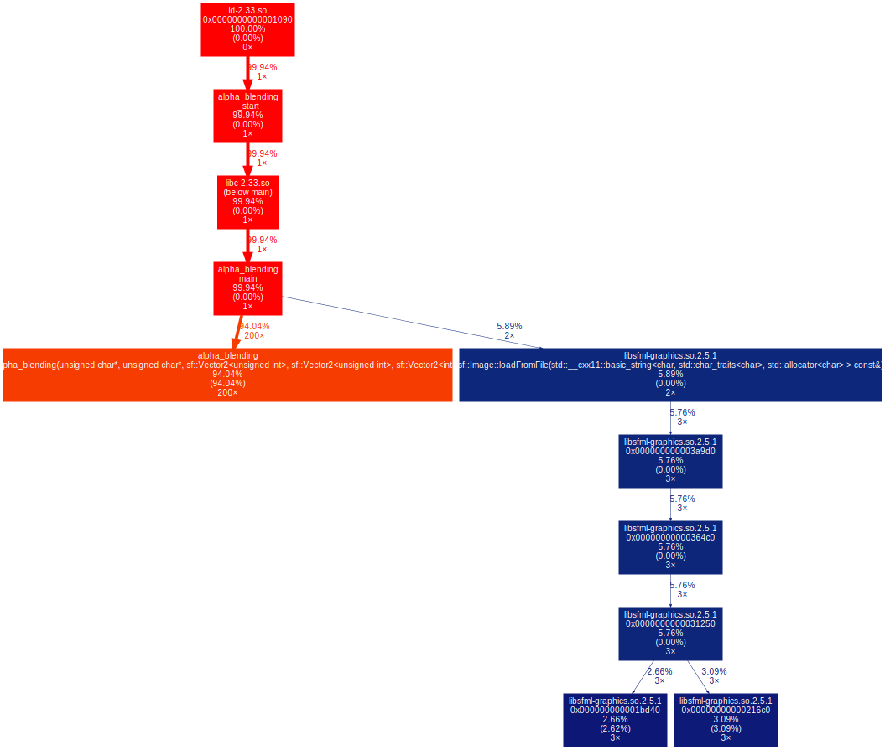
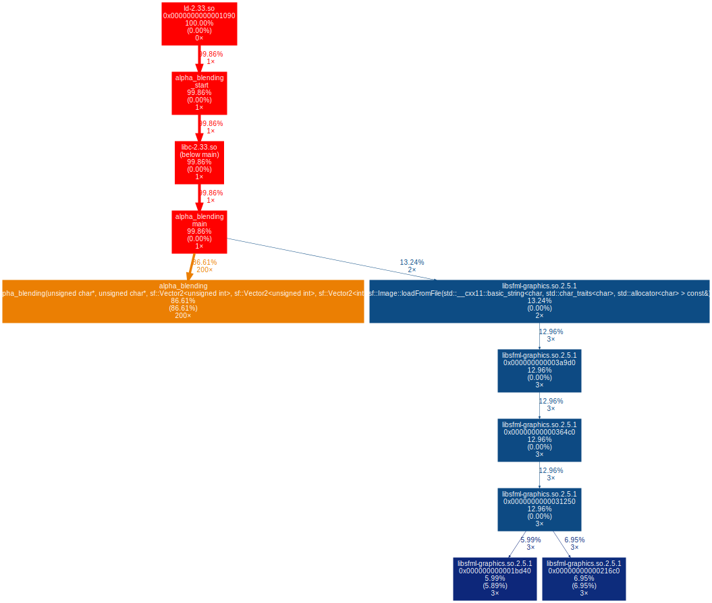

# Alpha blending

## Table of contents

[Main page](https://github.com/Panterrich/Alpha_blending)

[№0 optimization - the starting tests](https://github.com/Panterrich/Alpha_blending/tree/ver_0)

[№1 optimization - reduce overhead costs](https://github.com/Panterrich/Alpha_blending/tree/ver_1)

[№2 optimization - getting rid of divisions](https://github.com/Panterrich/Alpha_blending/tree/ver_2)

[№3 optimization - SSE optinization](https://github.com/Panterrich/Alpha_blending/tree/ver_3)
## №2 optimization.

It's time to change the algorithm and get rid of division.


A well-known way to approximate divide by 255
```
x/255 = (x + 1 + (x >> 8)) >> 8;
```

Since we have a limited set of values, we can create a matrix (256x256) with the result already calculated

As a result, we get the following implementation.

```C++
void Alpha_blending(sf::Uint8* back, sf::Uint8* front, \
                    const sf::Vector2u size_back, const sf::Vector2u size_front, const sf::Vector2i shift)
{
    static sf::Uint8 pixeles[256][256] = {};
    for (size_t i = 0; i < 256; ++i)
    {
        for (size_t j = 0; j < 256; ++j)
        {
            pixeles[i][j] = (i * j + 1 + ((i * j) >> 8)) >> 8;
        }
    }

    size_t begin_back_y  = (shift.y > 0) ? shift.y : 0;
    size_t begin_front_y = (shift.y > 0) ? 0 : -shift.y;
    size_t begin_back_x  = (shift.x > 0) ? shift.x : 0;
    size_t begin_front_x = (shift.x > 0) ? 0 : -shift.x;
    
    for (size_t back_y = begin_back_y, front_y = begin_front_y; \
                (back_y < size_back.y && front_y < size_front.y); ++back_y, ++front_y)
    {
        sf::Uint8* current_back  = back  + ((back_y  * size_back.x  + begin_back_x)  << 2);
        sf::Uint8* current_front = front + ((front_y * size_front.x + begin_front_x) << 2);

        for (size_t back_x = begin_back_x, front_x = begin_front_x; \
                    (back_x < size_back.x && front_x < size_front.x); ++back_x, ++front_x)
        {
            sf::Uint8 alpha = current_front[3];

            if (alpha != 0)
            {
                sf::Uint8 not_alpha = 255 - alpha;

                current_back[0] = pixeles[current_back[0]][not_alpha] + pixeles[current_front[0]][alpha];
                current_back[1] = pixeles[current_back[1]][not_alpha] + pixeles[current_front[1]][alpha];
                current_back[2] = pixeles[current_back[2]][not_alpha] + pixeles[current_front[2]][alpha];
                current_back[3] = pixeles[current_back[3]][not_alpha] + pixeles[current_front[3]][alpha];
            }

            current_back  += 4;
            current_front += 4;
        }
    }
}
```

Let's check it on the tests.
# With -O0 
```makefile
g++ alpha_blending.cpp main.cpp -O0 -g -o alpha_blending -lsfml-graphics 
```

.png "The hottest function")
.png "Important thing")


# With -O3

```makefile
g++ alpha_blending.cpp main.cpp -O3 -g -o alpha_blending -lsfml-graphics 
```

.png "The hottest function")
.png "Important thing")


# Result 

This is a victory. Without optimizations (-O0), the program sped up compared to the previous version by 85% (there were 23,8 billion instructions, now - 12,9 billion), and with optimization (-O3), it sped up by 186% (there were 5,7 billion instructions, now - 16,4 billion)
