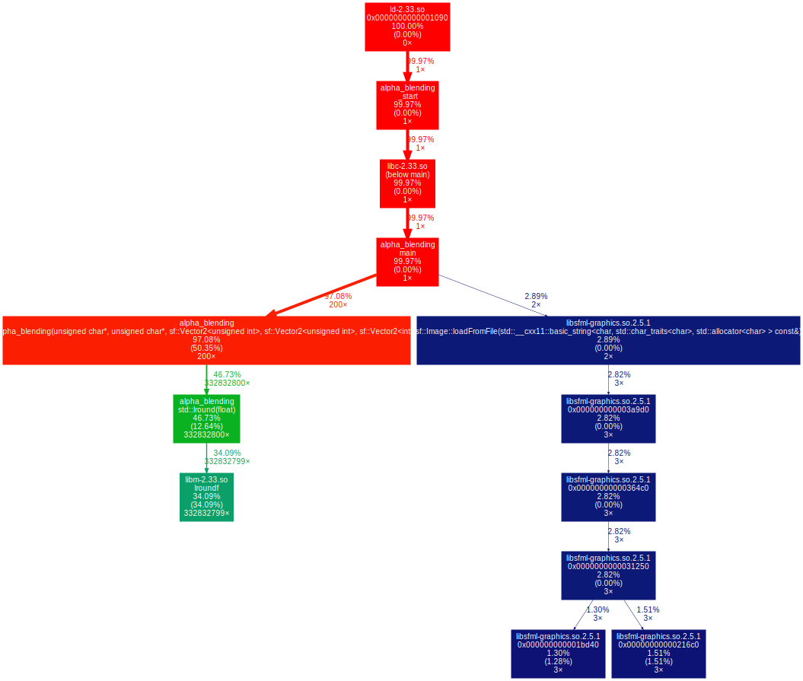

# Alpha blending

## First simple version without optimizations.

So this is the simplest version of the program that performs alpha blending.

Example of the program result:


Now let's run the tests. Repeat alpha blending 100 times. (Read from files 1 time, but don't write to files)

# With -O0 
```makefile
g++ alpha_blending.cpp main.cpp -O0 -g -o alpha_blending -lsfml-graphics 
```

.png "The hottest function")
.png "Important thing")


# With -O3

```makefile
g++ alpha_blending.cpp main.cpp -O3 -g -o alpha_blending -lsfml-graphics 
```

.png "The hottest function")
.png "Important thing")
