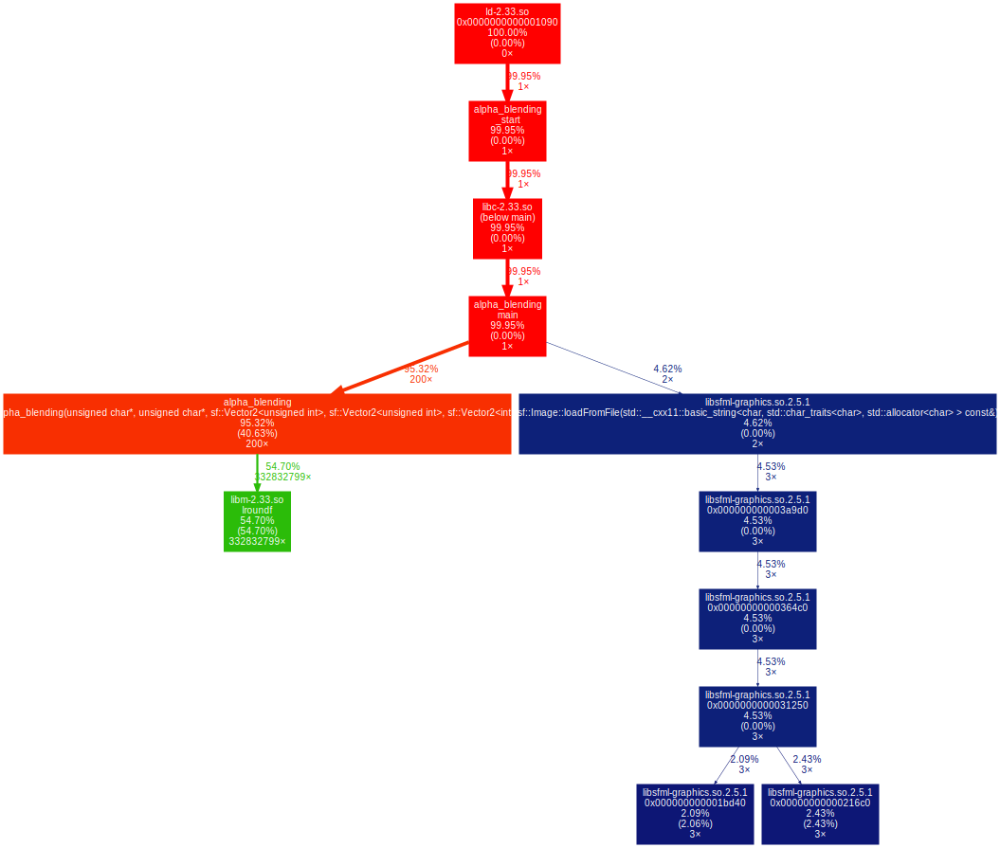

# Alpha blending

## Table of contents

[Main page](https://github.com/Panterrich/Alpha_blending)

[№0 optimization - the starting tests](https://github.com/Panterrich/Alpha_blending/tree/ver_0)

[№2 optimization - getting rid of divisions](https://github.com/Panterrich/Alpha_blending/tree/ver_2)

[№3 optimization - SSE optinization](https://github.com/Panterrich/Alpha_blending/tree/ver_3)
## №1 optimization.

First, let's look at the implementation of the function

```c++
void Alpha_blending(sf::Uint8* back, sf::Uint8* front, \
                    const sf::Vector2u size_back, const sf::Vector2u size_front, const sf::Vector2i shift)
{
    for (size_t back_y = (shift.y > 0) ? shift.y : 0, front_y = (shift.y > 0) ? 0 : -shift.y; \
                (back_y < size_back.y && front_y < size_front.y); ++back_y, ++front_y)
    {
        for (size_t back_x = (shift.x > 0) ? shift.x : 0, front_x = (shift.x > 0) ? 0 : -shift.x ; \
                    (back_x < size_back.x && front_x < size_front.x); ++back_x, ++front_x)
        {
            sf::Uint8* current_back  = back  + ((back_y  * size_back.x  + back_x)  << 2);
            sf::Uint8* current_front = front + ((front_y * size_front.x + front_x) << 2);

            sf::Uint8 balpha = current_front[3];

            if (balpha != 0)
            {
                float not_alpha = 1.0f - (float)((double)(balpha) * (1.0f / 255.f));

                current_back[0] = lround(float(current_back[0] * not_alpha) + current_front[0]);
                current_back[1] = lround(float(current_back[1] * not_alpha) + current_front[1]);
                current_back[2] = lround(float(current_back[2] * not_alpha) + current_front[2]);
                current_back[3] = lround(float(current_back[3] * not_alpha) + current_front[3]);
            }
        }
    }
}
```

Let's try to reduce the overhead of our function. We will remove the counting of the initial values from the loop and remove the recalculation of pointers to the current pixels

As a result, we get the following implementation:

```c++
void Alpha_blending(sf::Uint8* back, sf::Uint8* front, \
                    const sf::Vector2u size_back, const sf::Vector2u size_front, const sf::Vector2i shift)
{
    size_t begin_back_y  = (shift.y > 0) ? shift.y  : 0;
    size_t begin_front_y = (shift.y > 0) ? 0 : -shift.y;
    size_t begin_back_x  = (shift.x > 0) ? shift.x  : 0;
    size_t begin_front_x = (shift.x > 0) ? 0 : -shift.x;

    for (size_t back_y = begin_back_y, front_y = begin_front_y; \
                (back_y < size_back.y && front_y < size_front.y); ++back_y, ++front_y)
    {
        sf::Uint8* current_back  = back  + ((back_y  * size_back.x  + begin_back_x)  << 2);
        sf::Uint8* current_front = front + ((front_y * size_front.x + begin_front_x) << 2);


        for (size_t back_x = begin_back_x, front_x = begin_front_y; \
                    (back_x < size_back.x && front_x < size_front.x); ++back_x, ++front_x)
        {
            sf::Uint8 balpha = current_front[3];

            if (balpha != 0)
            {
                float alpha     = (float)((double)(balpha) * (1.0f / 255.f));
                float not_alpha = 1.0f - alpha;

                current_back[0] = lround(float(current_back[0] * not_alpha) + current_front[0] * alpha);
                current_back[1] = lround(float(current_back[1] * not_alpha) + current_front[1] * alpha);
                current_back[2] = lround(float(current_back[2] * not_alpha) + current_front[2] * alpha);
                current_back[3] = lround(float(current_back[3] * not_alpha) + current_front[3] * alpha);
            }

            current_back  += 4;
            current_front += 4;
        }
    }
}
```

Let's test the new version.

# With -O0 
```makefile
g++ alpha_blending.cpp main.cpp -O0 -g -o alpha_blending -lsfml-graphics 
```

.png "The hottest function")
.png "Important thing")


# With -O3

```makefile
g++ alpha_blending.cpp main.cpp -O3 -g -o alpha_blending -lsfml-graphics 
```

.png "The hottest function")
.png "Important thing")


# Result

As a result, the program sped up by 10,5% (there were 26,3 billion instructions, now - 23,8 billion) without optimizations (-O0), and slowed down by 3% (there were 15,9 billion, now - 16,4 billion) with optimization (-O3).

The program barely sped up(

